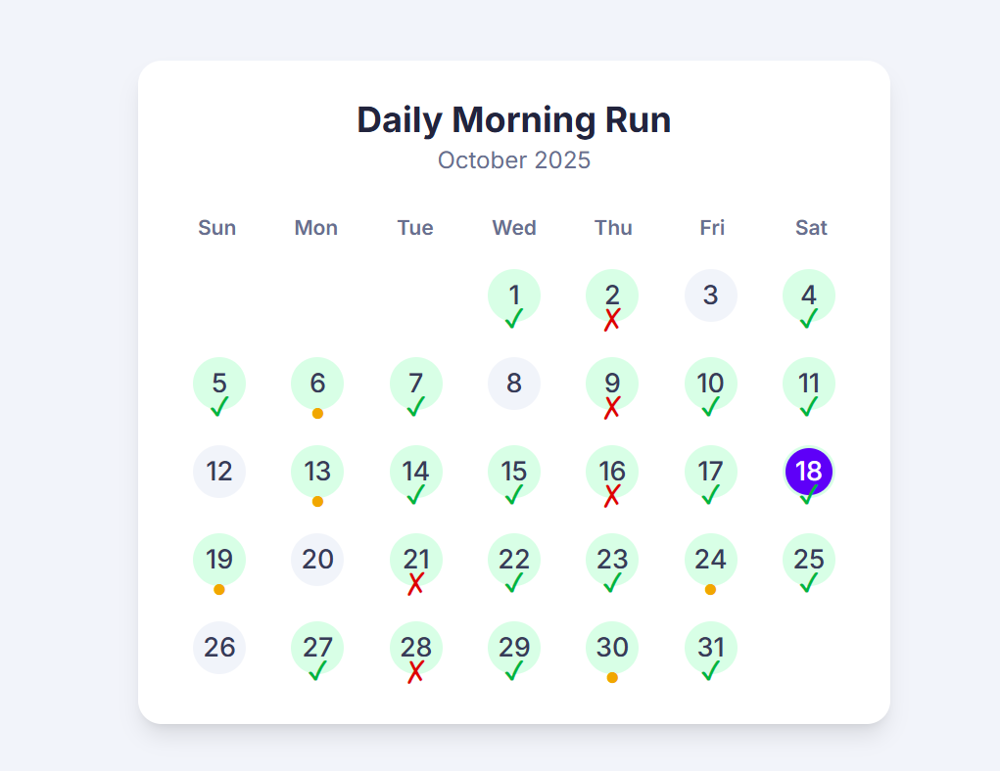

# Dot Calendar

A dot grid calendar visualization tool. Displays days of the month as a grid of numbered circles/dots. Each dot represents a date and can show associated information when data is provided.

## Features

-   Grid-based calendar view
-   Dot visualization for dates
-   Data overlay support
-   static and api data source version
-   all code and style in one page , can be splitted
-   one version in Bootstrap, another in TailwindCSS
